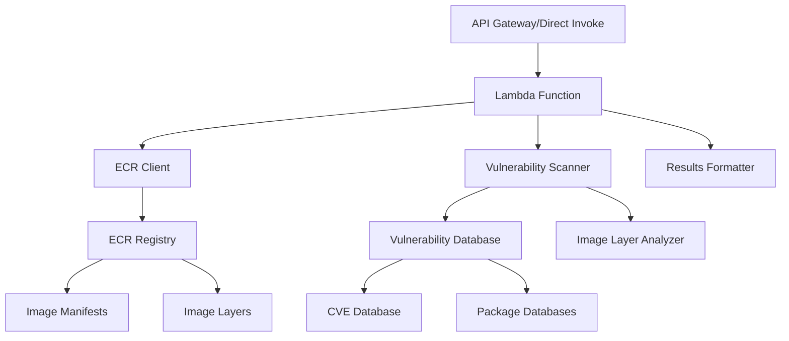
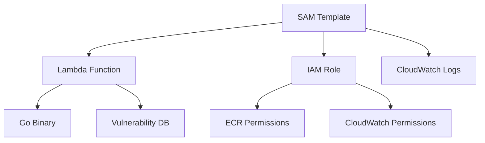

# Design Document

## Overview

The ECR Image Scanner is a serverless application built with Go that performs custom vulnerability scanning of container images stored in Amazon ECR. The system pulls image manifests and layers, analyzes them for known vulnerabilities using vulnerability databases, and returns structured results with severity classifications.

The solution uses AWS Lambda with the `provided.al2` runtime to execute compiled Go binaries, deployed via SAM (Serverless Application Model). The scanner supports both basic and enhanced scanning modes, with the ability to run locally for development and testing.

## Architecture

### High-Level Architecture



### Component Flow

1. **Input Processing**: Lambda receives image URL and tag, with optional scan mode
2. **ECR Integration**: Authenticate and pull image manifest and layers
3. **Image Analysis**: Extract package information from image layers
4. **Vulnerability Matching**: Compare packages against vulnerability databases
5. **Result Processing**: Format findings with severity counts and metadata
6. **Response**: Return structured JSON with scan results

## Components and Interfaces

### 1. Lambda Handler

**Purpose**: Entry point for Lambda execution and local binary execution

**Interface**:
```go
type LambdaEvent struct {
    ImageURL        string            `json:"imageUrl"`
    Tag             string            `json:"tag"`
    ScanMode        string            `json:"scanMode,omitempty"`        // "basic" or "enhanced"
    Region          string            `json:"region,omitempty"`          // AWS region for ECR
    SeverityFilter  string            `json:"severityFilter,omitempty"`  // "CRITICAL", "HIGH", "MEDIUM", "LOW"
    MaxFindings     int               `json:"maxFindings,omitempty"`     // limit number of findings returned
    TimeoutSeconds  int               `json:"timeoutSeconds,omitempty"`  // scan timeout
    OutputFormat    string            `json:"outputFormat,omitempty"`    // "detailed", "summary"
    Config          map[string]string `json:"config,omitempty"`          // additional configuration options
}

type LambdaResponse struct {
    ScanResults ScanResults `json:"scanResults"`
    Metadata    ScanMetadata `json:"metadata"`
    Error       string      `json:"error,omitempty"`
}
```

### 2. ECR Client

**Purpose**: Handle ECR authentication and image retrieval

**Interface**:
```go
type ECRClient interface {
    GetAuthorizationToken(ctx context.Context) (*AuthToken, error)
    GetImageManifest(ctx context.Context, repo, tag string) (*ImageManifest, error)
    GetImageLayers(ctx context.Context, repo string, layers []LayerDigest) ([]ImageLayer, error)
}
```

### 3. Vulnerability Scanner

**Purpose**: Core scanning logic for analyzing image contents

**Interface**:
```go
type VulnerabilityScanner interface {
    ScanImage(ctx context.Context, manifest *ImageManifest, layers []ImageLayer, mode ScanMode) (*ScanResults, error)
    LoadVulnerabilityDatabase(ctx context.Context) error
}

type ScanResults struct {
    TotalVulnerabilities int                    `json:"totalVulnerabilities"`
    SeverityCounts      map[string]int         `json:"severityCounts"`
    Findings            []VulnerabilityFinding `json:"findings"`
}

type VulnerabilityFinding struct {
    CVE         string `json:"cve"`
    Package     string `json:"package"`
    Version     string `json:"version"`
    Severity    string `json:"severity"`
    Description string `json:"description"`
    FixedIn     string `json:"fixedIn,omitempty"`
}
```

### 4. Image Layer Analyzer

**Purpose**: Extract package information from container image layers

**Interface**:
```go
type LayerAnalyzer interface {
    AnalyzeLayers(ctx context.Context, layers []ImageLayer) (*PackageInventory, error)
    ExtractPackages(ctx context.Context, layer ImageLayer) ([]Package, error)
}

type PackageInventory struct {
    Packages []Package `json:"packages"`
    OS       string    `json:"os"`
    OSVersion string   `json:"osVersion"`
}

type Package struct {
    Name    string `json:"name"`
    Version string `json:"version"`
    Type    string `json:"type"` // "deb", "rpm", "apk", etc.
}
```

### 5. Vulnerability Database

**Purpose**: Manage vulnerability data sources and matching logic

**Interface**:
```go
type VulnDatabase interface {
    Initialize(ctx context.Context) error
    FindVulnerabilities(ctx context.Context, pkg Package, os string) ([]VulnerabilityFinding, error)
    GetDatabaseInfo() DatabaseInfo
}

type DatabaseInfo struct {
    LastUpdated time.Time `json:"lastUpdated"`
    Version     string    `json:"version"`
    Sources     []string  `json:"sources"`
}
```

## Data Models

### Core Data Structures

```go
type ScanMode string

const (
    ScanModeBasic    ScanMode = "basic"
    ScanModeEnhanced ScanMode = "enhanced"
)

type ScanMetadata struct {
    ScanID        string    `json:"scanId"`
    ImageURL      string    `json:"imageUrl"`
    Tag           string    `json:"tag"`
    ScanMode      ScanMode  `json:"scanMode"`
    ScanStartTime time.Time `json:"scanStartTime"`
    ScanEndTime   time.Time `json:"scanEndTime"`
    DatabaseInfo  DatabaseInfo `json:"databaseInfo"`
}

type ImageManifest struct {
    MediaType string        `json:"mediaType"`
    Digest    string        `json:"digest"`
    Layers    []LayerDigest `json:"layers"`
    Config    ConfigDigest  `json:"config"`
}

type LayerDigest struct {
    Digest    string `json:"digest"`
    MediaType string `json:"mediaType"`
    Size      int64  `json:"size"`
}

type ImageLayer struct {
    Digest  string `json:"digest"`
    Content []byte `json:"content"`
    Size    int64  `json:"size"`
}
```

## Error Handling

### Error Categories

1. **Authentication Errors**: ECR authorization failures
2. **Network Errors**: ECR API connectivity issues
3. **Image Errors**: Invalid image URLs, missing tags, corrupted layers
4. **Scanning Errors**: Vulnerability database issues, analysis failures
5. **Resource Errors**: Lambda timeout, memory limits

### Error Response Format

```go
type ErrorResponse struct {
    Error     string            `json:"error"`
    ErrorCode string            `json:"errorCode"`
    Details   map[string]string `json:"details,omitempty"`
    Retryable bool              `json:"retryable"`
}
```

### Error Handling Strategy

- **Graceful Degradation**: Return partial results when possible
- **Retry Logic**: Implement exponential backoff for transient failures
- **Timeout Management**: Set appropriate timeouts for ECR operations
- **Resource Cleanup**: Ensure proper cleanup of downloaded layers

## Testing Strategy

### Unit Testing

1. **ECR Client Tests**: Mock ECR API responses for various scenarios
2. **Scanner Logic Tests**: Test vulnerability matching with known datasets
3. **Layer Analysis Tests**: Verify package extraction from sample layers
4. **Error Handling Tests**: Validate error scenarios and edge cases

### Integration Testing

1. **End-to-End Tests**: Test complete flow with real ECR images
2. **Performance Tests**: Validate scanning performance with various image sizes
3. **Local Binary Tests**: Verify local execution matches Lambda behavior

### Test Data Strategy

- **Sample Images**: Create test images with known vulnerabilities
- **Mock Responses**: Use recorded ECR API responses for consistent testing
- **Vulnerability Fixtures**: Maintain test vulnerability database snapshots

## Configuration

### Input Configuration Options

The scanner supports various configuration options to customize scanning behavior:

| Parameter | Type | Required | Default | Description |
|-----------|------|----------|---------|-------------|
| `imageUrl` | string | Yes | - | ECR image URL to scan |
| `tag` | string | Yes | - | Image tag to scan |
| `scanMode` | string | No | "basic" | Scanning mode: "basic" or "enhanced" |
| `region` | string | No | AWS_REGION env | AWS region for ECR access |
| `severityFilter` | string | No | - | Minimum severity: "CRITICAL", "HIGH", "MEDIUM", "LOW" |
| `maxFindings` | int | No | 1000 | Maximum number of findings to return |
| `timeoutSeconds` | int | No | 300 | Scan timeout in seconds |
| `outputFormat` | string | No | "detailed" | Output format: "detailed" or "summary" |
| `config` | map | No | {} | Additional configuration key-value pairs |

### Environment Variables

The application supports configuration via environment variables:

- `AWS_REGION`: Default AWS region for ECR access
- `VULN_DB_SOURCE`: Vulnerability database source URL
- `LOG_LEVEL`: Logging level (DEBUG, INFO, WARN, ERROR)
- `MAX_LAYER_SIZE`: Maximum layer size to process (bytes)
- `CACHE_ENABLED`: Enable layer caching (true/false)

### Default Behavior

- **Scan Mode**: Basic scanning by default
- **Severity Filter**: All severities included
- **Output Format**: Detailed findings with full vulnerability information
- **Timeout**: 5-minute default timeout for Lambda execution
- **Region**: Uses Lambda execution environment region

## Implementation Considerations

### Vulnerability Database Strategy

**Basic Mode**: 
- Use embedded vulnerability database (CVE feeds)
- Focus on critical and high severity vulnerabilities
- Lightweight package matching

**Enhanced Mode**:
- Include additional vulnerability sources (GitHub Security Advisories, etc.)
- More comprehensive package analysis
- Language-specific vulnerability databases

### Performance Optimizations

1. **Layer Caching**: Cache analyzed layers to avoid reprocessing
2. **Parallel Processing**: Analyze multiple layers concurrently
3. **Memory Management**: Stream large layers instead of loading entirely
4. **Database Indexing**: Optimize vulnerability lookup performance

### Security Considerations

1. **IAM Permissions**: Minimal ECR read-only permissions
2. **Data Handling**: Secure handling of image layer contents
3. **Vulnerability Data**: Ensure vulnerability database integrity
4. **Logging**: Avoid logging sensitive image contents

### Deployment Architecture



### Local Development Support

- **Binary Execution**: Support command-line execution with same interface
- **Configuration**: Environment-based configuration for AWS credentials
- **Output Format**: Consistent JSON output for both Lambda and local execution
- **Debug Mode**: Additional logging and intermediate result output